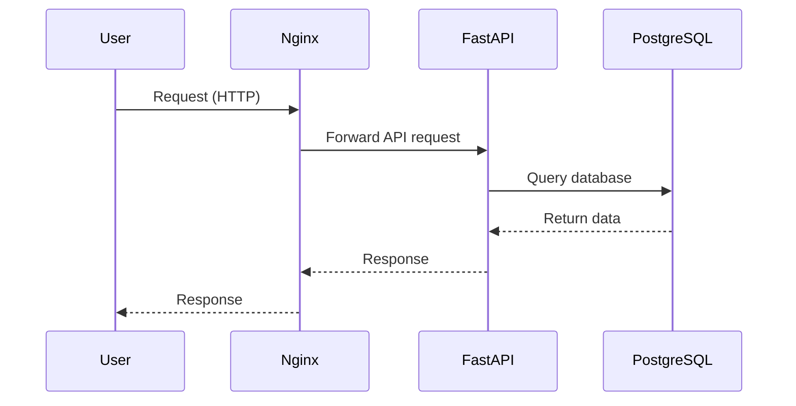

# FastAPI Project with Database (3-Tier Architecture)


## 🏗️ Project Overview
This is a **3-tier FastAPI application** with:
1. **Backend**: FastAPI service (`user_service/`)
2. **Database**: PostgreSQL (`db/`)
3. **Reverse Proxy**: Nginx (`nginx/`)

The application is fully containerized using **Docker** and orchestrated with **Docker Compose**.

---

## 🚀 Features
✅ FastAPI backend with automatic docs (`/docs`)
✅ PostgreSQL database with health checks
✅ Nginx as a reverse proxy for better security
✅ Environment variables managed with `.env`
✅ Dockerized for easy deployment

---

## 🏗️ Architecture



---

## 📂 Folder Structure


```
FastAPI_project_with_Database/
│── user_service/          # FastAPI Backend Service
│   ├── app/
│   │   ├── main.py        # Main FastAPI application
│   │   ├── schemas.py     # Pydantic models
│   │   ├── crud.py        # Database operations
│   │   ├── database.py    # DB connection setup
│   ├── requirements.txt   # Python dependencies
│   ├── Dockerfile         # FastAPI container
│
│── db/                   # Database Service (PostgreSQL)
│   ├── Dockerfile
│
│── nginx/                # Reverse Proxy Service
│   ├── nginx.conf        # Nginx Configuration
│   ├── Dockerfile
│
│── docker-compose.yml    # Docker Compose setup
│── .env                  # Environment variables
│── README.md             # This documentation
```

---

## 🎥 How It Works (Step-by-Step with GIF)


1. **User sends a request** → Nginx handles it
2. **Nginx forwards request** → FastAPI service processes it
3. **FastAPI queries the PostgreSQL database** → Fetches/stores data
4. **Response is sent back** → User receives the processed result

---

## 🛠️ Setup & Installation

### **1️⃣ Clone the Repository**
```sh
git clone https://github.com/your-repo/FastAPI_project_with_Database.git
cd FastAPI_project_with_Database
```

### **2️⃣ Configure Environment Variables**
Rename `.env.example` to `.env` and update the database credentials:
```
POSTGRES_DB=mydatabase
POSTGRES_USER=myuser
POSTGRES_PASSWORD=mypassword
```

### **3️⃣ Build & Start Services**
```sh
docker-compose up --build -d
```

### **4️⃣ Access the Application**
- **API Docs**: [http://localhost:8000/docs](http://localhost:8000/docs)
- **Database Admin (pgAdmin)**: [http://localhost:8080](http://localhost:8080)

---

## 📝 API Endpoints
### **User Service** (`/user_service/app/main.py`)

| Method | Endpoint  | Description |
|--------|----------|-------------|
| `GET`  | `/users` | Get all users |
| `POST` | `/users` | Create a user |
| `GET`  | `/users/{id}` | Get user by ID |
| `PUT`  | `/users/{id}` | Update user |
| `DELETE` | `/users/{id}` | Delete user |

---

## 🎯 Future Goals
✅ Add authentication with JWT
✅ Implement CI/CD with GitHub Actions
✅ Deploy to Kubernetes (AWS EKS/GKE)
✅ Add caching with Redis
✅ Implement GraphQL support

---

## 🛠️ Troubleshooting
- **Check running containers**: `docker ps`
- **View logs**: `docker logs <container_id>`
- **Restart a service**: `docker-compose restart user-service`
- **Remove all containers**: `docker-compose down -v`
- **Remove all the images**: `docker system prune -a`
- **Check database connection**: `pg_isready -U myuser -d mydatabase`

---

## 🤝 Contributing
1. Fork the repository
2. Create a feature branch
3. Commit your changes
4. Push and submit a PR

🚀 **Happy Coding!**  
   ## T S Sundar Raj

